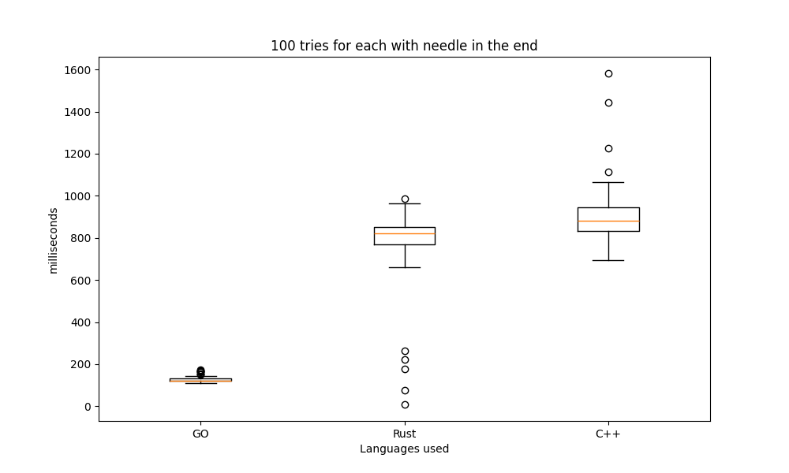
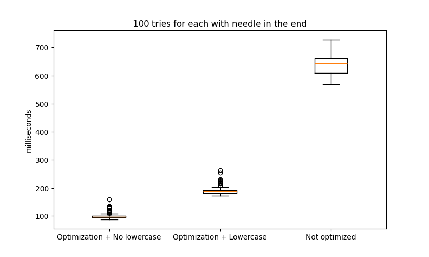
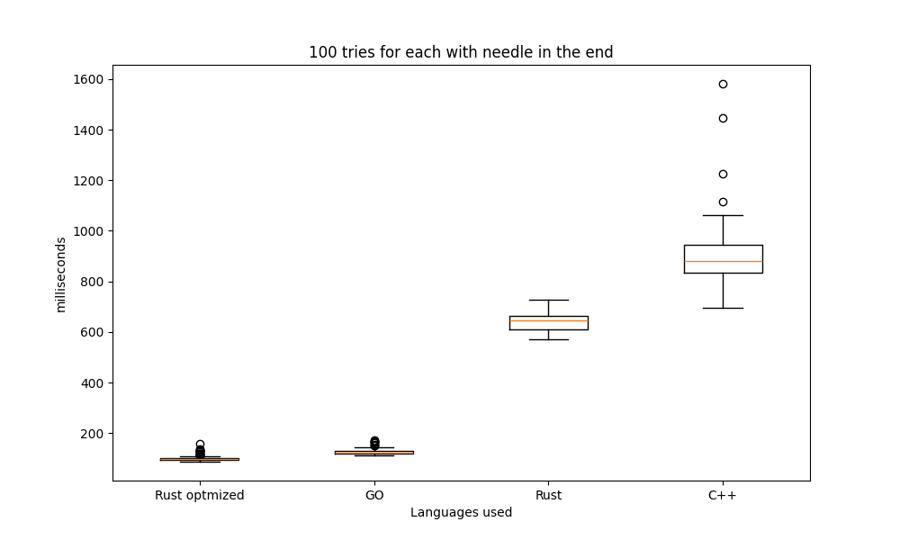
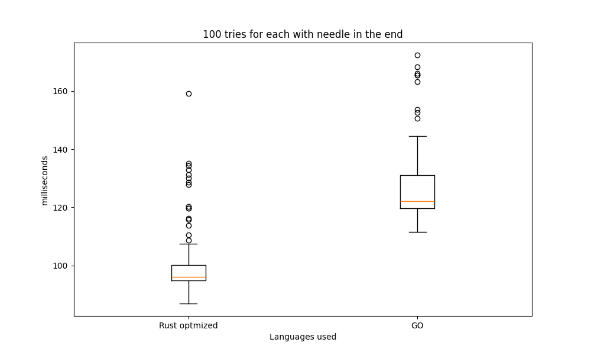

# file-search-comparison
Haystack search in 1MB file and 54MB file in GO, Rust, C++
We have three different files. In each of these file we have placed a needle that needs to be retrieved at the end of file.
This is the result



GO seems like the winner but the fact that it takes so little compared to language like C++ and Rust makes me wonder what magic are they actually using.

In order to compile rust code I was using:
```
rustc word_search_big.rs
```
Utilizing the optimization (step1: remove lowercase, step2: change compiler options) and the code provided by a reddit user [discussion link](https://www.reddit.com/r/golang/comments/1f45h6i/comment/lkjh5gk/?utm_source=share&utm_medium=web3x&utm_name=web3xcss&utm_term=1&utm_content=share_button)
```
rustc -C opt-level=3 .\word_search_big.rs
```
The performance drastically improves.

Here is the rust after the optimizations just discussed


(another user suggested to use cargo instead of directly rustc, I think this is good practice since cargo offers a rich set of features for project setup, dependency management, building, testing, and deploying Rust applications)

## Final image


## Only best two


## Considerations

So the point in the end is optimization. Go has already builtin methods to optimize file reading while in rust and c++ it doesnt come out of the box. A further research would be needed for
improving the c++ code that should be more performant than the other two languages
